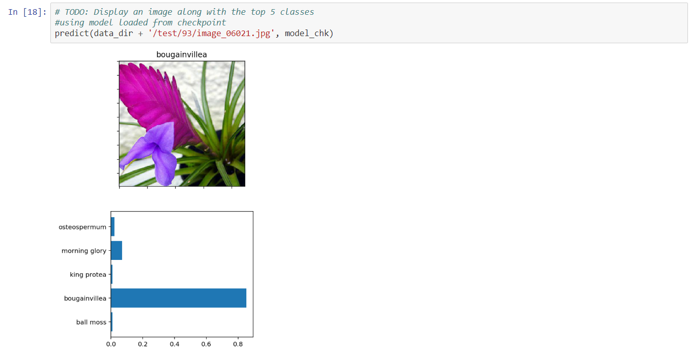
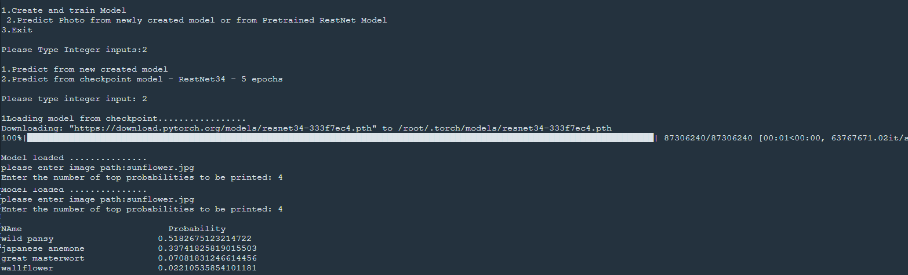

# Deep Learning Project
# Flower Image Classifier, Transfer Learning
## Developing an AI Application, 102 Flower Classification
### Requires GPU environment

### Installation
1. **Python 3.6**  and libraries
 - [Numpy](http://www.numpy.org/)
 - [Matplotlib](http://matplotlib.org/)
 - [Seaborn](http://matplotlib.org/)
 - [scikit-learn](http://scikit-learn.org/stable/)
 
 2. Anaconda 
 - Jupyther Notebook
 - [PyTorch, TorchVission](https://pytorch.org/get-started/locally/)
 
 ### Transfer Learning
 Model trained on one task is re-purposed on another related task. 
 
  ### Resources
 - Train, Test and Validation Flower folder
 https://github.com/udacity/aipnd-project
 - Json File, Category label to category name. 
 
 ### Code
 1. Load and transform training, testing and vlidation images in batch.
 2. Load Torchvission model RestNet34.
 3. Re-defining classifer for RestNet34 model using Torch **nn** module
 4.  Training model using GPU.
 5. Saving checkpoints of the trained model
 6. Loading checkpoint
 7. Checking class with probabilities of input image
 
 #### Output
 
 
 ### Application
 `train.py`, will train a new network on a dataset and save the model as a checkpoint.
 The second file, `predict.py`, uses a trained network to predict the class for an input image.
 `main.py` gives an interface to call functions from train.py for training model and predict.py to call
 functions for predicting image after training.
 
 train.py
 - Prints out training loss, validation loss, and validation accuracy as the network trains
 - User inputs for hyperparameters - epochs, learning rate and hidden nodes
 - Option to choose between REstnet34 and vgg19 model
 
 predict.py
 - Return top KK most likely classes.
 - 
 
 ### Running Application
 in cmd
 
 ```bash
 python main.py
 ```
 
 ### Application validation
 - **Errors Handling**
    - FileNotFoundError - If user did not give correct url for the image
    - ValueError - If the user does not provide correct input type
 
 ### Application output
 Case 1: Training a new model and predicting
  
 
 Case 2: Predicting using loading model checkpoint
  
 
